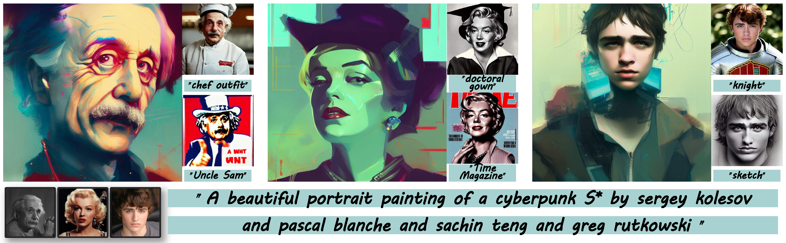

# PersonaMagic: Stage-Regulated High-Fidelity Face Customization with Tandem Equilibrium (AAAI 2025)


>**PersonaMagic: Stage-Regulated High-Fidelity Face Customization with Tandem Equilibrium**<br>
>Xinzhe Li, Jiahui Zhan, Shengfeng He, Yangyang Xu, Junyu Dong, Huaidong Zhang, Yong Du<sup>*</sup>( * indicates corresponding author)
>
>Personalized image generation has made significant strides in adapting content to novel concepts. However, a persistent challenge remains: balancing the accurate reconstruction of unseen concepts with the need for editability according to the prompt, especially when dealing with the complex nuances of facial features. In this study, we delve into the temporal dynamics of the text-to-image conditioning process, emphasizing the crucial role of stage partitioning in introducing new concepts. We present PersonaMagic, a stage-regulated generative technique designed for high-fidelity face customization. Using a simple MLP network, our method learns a series of embeddings within a specific timestep interval to capture face concepts. Additionally, we develop a Tandem Equilibrium mechanism that adjusts self-attention responses in the text encoder, balancing text description and identity preservation, improving both areas. Extensive experiments confirm the superiority of PersonaMagic over state-of-the-art methods in both qualitative and quantitative evaluations. Moreover, its robustness and flexibility are validated in non-facial domains, and it can also serve as a valuable plug-in for enhancing the performance of pretrained personalization models.

<a href='https://arxiv.org/abs/2412.15674'></a>


# Table of Contents
- [Description](#description)
- [Setup](#setup)

- [Usage](#usage)
  * [Pretrained Models](#pretrained-models)
  * [Training](#training)
  * [Inference](#inference)
- [Acknowledgements](#acknowledgements)

# Description  
Official PyTorch implementation of "PersonaMagic: Stage-Regulated High-Fidelity Face Customization with Tandem Equilibrium"

<p align="center">
  
PersonaMagic seamlessly generates images of new roles, styles, or scenes based on a user-provided portrait. By
 learning stage-regulated embeddings through a Tandem Equilibrium strategy, our method accurately captures and represents
 unseen concepts, faithfully creating personas aligned with the provided prompts while minimizing identity distortion.
<br>
</p>


# Setup
Clone and enter into repo directory.
```
git clone https://github.com/xzhe-Vision/PersonaMagic.git
cd PersonaMagic
```
Install requirements using following scripts.
```
conda env create -f environment/environment.yaml
conda activate persona
```

# Usage
## Pretrained Models

Our code supports the official [Stable Diffusion v1.4](https://huggingface.co/CompVis/stable-diffusion-v1-4) model and the [dreamlike-photoreal-2.0](https://huggingface.co/dreamlike-art/dreamlike-photoreal-2.0) model.

Download the pre-trained clip checkpoints, and put them in `checkpoints/`
```
wget "https://openaipublic.azureedge.net/clip/models/8fa8567bab74a42d41c5915025a8e4538c3bdbe8804a470a72f30b0d94fab599/RN101.pt"
wget "https://openaipublic.azureedge.net/clip/models/40d365715913c9da98579312b702a82c18be219cc2a73407c4526f58eba950af/ViT-B-32.pt"
wget "https://openaipublic.azureedge.net/clip/models/5806e77cd80f8b59890b7e101eabd078d9fb84e6937f9e85e4ecb61988df416f/ViT-B-16.pt"

```
## Training
To train your own concept, you need to prepare at least one image and use clipseg to generate the corresponding mask. For example:
```
python scripts/seg.py --image_dir data/person_1/ --super_class 'face'
```
Notes:
- `image_dir` should be the path to an image or a folder.
- `super_class` should be the class of the concept.

You need to set a config file specifying all training parameters, and then run the following command:
```
python scripts/train.py --config_path input_configs/train.yaml
```
Notes:
- All training arguments can be found in the `RunConfig` class in `training/config.py`.
- `train_data_dir` : image folder for training.
- `pretrained_model_name_or_path`: pretrained Stable Diffusion v1.4 model or dreamlike-photoreal-2.0 model.
- `clip_ckpt_path` : the path of pre-trained clip checkpoints.
## Inference
Run the following command for inference:
```
python scripts/inference.py --config_path input_configs/inference.yaml
```
Notes:
- pass an `input_dir` and `iteration` to extract the corresponding checkpoint
- `prompts_file_path` is a text file for specifying the prompts.

# Acknowledgements
Our code references the implementation of [NeTI](https://github.com/NeuralTextualInversion/NeTI) and [diffusers implementation of textual inversion](https://github.com/huggingface/diffusers/tree/main/examples/textual_inversion). Thanks for their awesome works.


# Citation
If you use this code for your research, please cite the following work: 
```
@inproceedings{li2025personamagic,
  title={PersonaMagic: Stage-Regulated High-Fidelity Face Customization with Tandem Equilibrium},
  author={Li, Xinzhe and Zhan, Jiahui and He, Shengfeng and Xu, Yangyang and Dong, Junyu and Zhang, Huaidong and Du, Yong},
  booktitle={Proceedings of the AAAI Conference on Artificial Intelligence},
  volume={39},
  number={5},
  pages={4995--5003},
  year={2025}
}
```